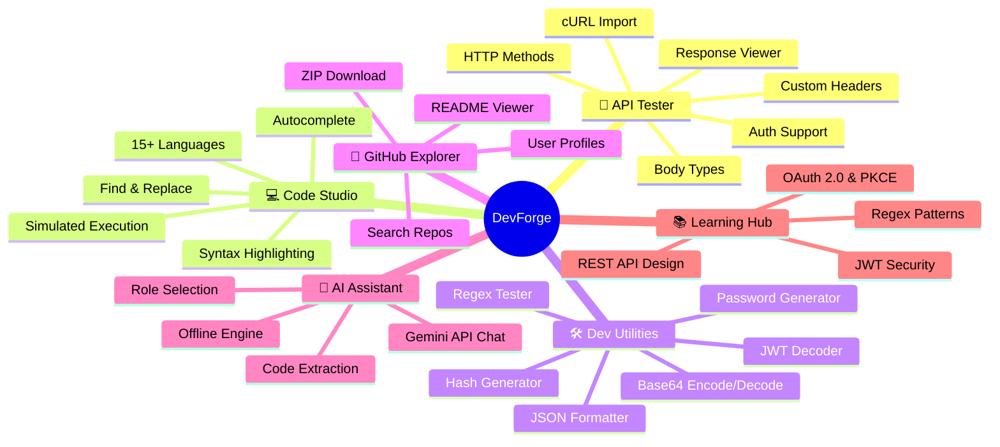
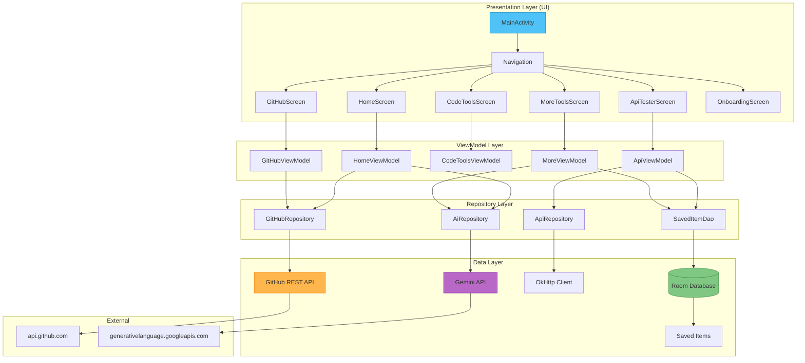
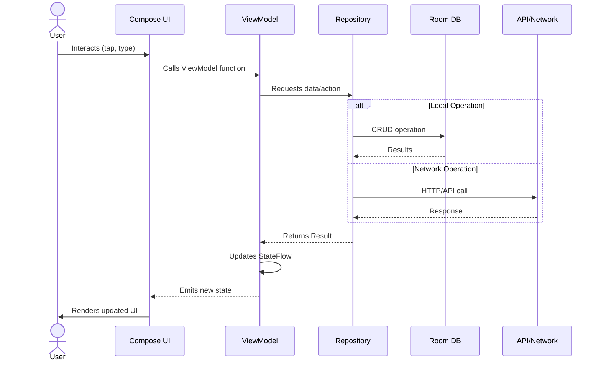
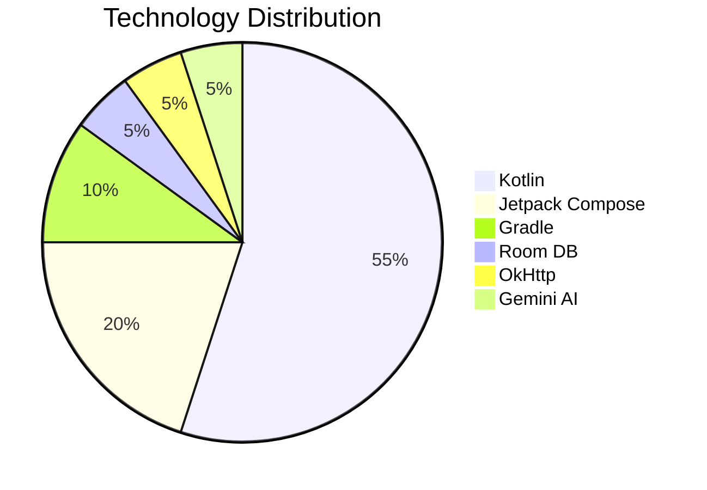

<div align="center">
  
  <h1 align="center">🔥 DevForge</h1>
  <p align="center">
    <strong>All-in-One Mobile Developer Toolkit</strong>
    <br />
    Built with Kotlin & Jetpack Compose | Powered by Gemini AI
  </p>
  <p align="center">
    <a href="#-features">Features</a> •
    <a href="#-architecture">Architecture</a> •
    <a href="#-tech-stack">Tech Stack</a> •
    <a href="#-screenshots">Screenshots</a> •
    <a href="#-getting-started">Getting Started</a> •
    <a href="#-project-structure">Project Structure</a>
  </p>
</div>

---

## 📋 Overview

**DevForge** is a comprehensive mobile toolkit designed for developers on the go. It combines an API tester, code editor, JSON tools, regex playground, GitHub explorer, and an AI-powered assistant into one sleek Android application. Whether you're debugging REST APIs, testing regex patterns, exploring GitHub repositories, or learning new technologies, DevForge has you covered.

---

## 🚀 Features



### 🔌 REST API Tester
Full-featured HTTP client supporting **GET, POST, PUT, PATCH, DELETE, HEAD, OPTIONS** methods with:
- **Authentication**: Bearer token, Basic Auth, API Key, JWT
- **Body Types**: JSON, XML, Plain Text, Form Data
- **Features**: Custom headers, query parameters, cURL import, response status/time/size viewer

### 💻 Multi-Language Code Studio
Code editor with line numbers and syntax highlighting for **15+ languages** including Kotlin, Java, Python, JavaScript, TypeScript, C, C++, C#, Rust, Go, Dart, PHP, Ruby, SQL, and more. Includes find/replace and simulated execution output.

### 🛠️ Developer Utilities
- **JSON Tools**: Beautify, minify, and validate JSON
- **Regex Playground**: Live pattern testing with 10 built-in presets (email, phone, URL, IP, UUID, JWT, etc.)
- **Encoders**: Base64 encode/decode, JWT token decoder
- **Generators**: UUID v4, secure passwords, hash (MD5, SHA-1, SHA-256)
- **Converters**: Unix epoch timestamp converter

### 🐙 GitHub Explorer
- Search public repositories by keyword
- Browse GitHub user profiles with avatar, bio, and stats
- View public repositories and README files
- Download/clone repos as ZIP archives

### 🤖 AI Assistant (Gemini)
Multi-turn chat powered by **Google Gemini API** with three personas:
- **General Assistant** – Everyday coding help
- **Senior Architect** – Advanced architectural guidance
- **Fast Explainer** – Quick, concise explanations
- Includes code snippet extraction and offline fallback engine

### 📚 Learning Hub
Built-in developer tutorials covering:
- REST API Design Best Practices
- OAuth 2.0 & PKCE Flow
- JWT Security & Authentication
- Regex Patterns & Usage

---

## 🏗️ Architecture



### MVVM + Clean Architecture

The app follows the **Model-View-ViewModel (MVVM)** pattern with a clean separation of concerns:

| Layer | Description | Components |
|-------|-------------|------------|
| **UI** | Jetpack Compose screens & components | `MainActivity`, Screen composables, CommonComponents (`GlassCard`, `SyntaxCodeViewer`, etc.) |
| **ViewModel** | State management with `StateFlow` | `HomeViewModel`, `ApiViewModel`, `CodeToolsViewModel`, `GitHubViewModel`, `MoreViewModel` |
| **Repository** | Business logic & data orchestration | `ApiRepository`, `AiRepository`, `GitHubRepository` |
| **Data** | Local persistence & remote sources | `AppDatabase` (Room), `SavedItemDao`, OkHttp client, Gemini API client |

### Data Flow



---

## 🧰 Tech Stack



| Category | Technology | Version |
|----------|-----------|---------|
| **Language** | Kotlin | 2.2.10 |
| **UI Framework** | Jetpack Compose (Material3) | BOM 2024.09.00 |
| **Min SDK / Target** | Android API 24 / 36 | - |
| **Architecture** | MVVM + Repository | - |
| **Networking** | OkHttp + Moshi | 4.10.0 / 1.15.2 |
| **AI/ML** | Gemini API (Google) | - |
| **Database** | Room + KSP | 2.7.0 |
| **Image Loading** | Coil | 2.7.0 |
| **Build System** | Gradle (Kotlin DSL) | 9.1.1 |
| **Testing** | JUnit, Robolectric, Roborazzi | - |

---

## 📸 Screenshots

<div align="center">
  <table>
    <tr>
      <td align="center"><b>Dashboard</b></td>
      <td align="center"><b>API Tester</b></td>
      <td align="center"><b>Code Studio</b></td>
    </tr>
    <tr>
      <td></td>
      <td></td>
      <td></td>
    </tr>
  </table>
</div>

---

## 🚦 Getting Started

### Prerequisites

- [Android Studio](https://developer.android.com/studio) (Latest version recommended)
- Android SDK 36
- JDK 17+
- A [Gemini API Key](https://ai.google.dev/gemini-api/docs/api-keys)

### Installation

1. **Clone the repository**

   ```bash
   git clone https://github.com/ZainulabdeenOfficial/Devforge.git
   cd Devforge
   ```

2. **Configure Gemini API Key**

   Create a `.env` file in the project root:

   ```env
   GEMINI_API_KEY=your_gemini_api_key_here
   ```

3. **Open in Android Studio**

   - Launch Android Studio
   - Select **Open** and navigate to the project directory
   - Allow Android Studio to sync Gradle and resolve dependencies

4. **Run the app**

   - Select a device/emulator (API 24+)
   - Click **Run** ▶️

> **Note**: If you don't have a Gemini API key, the app will still function for API testing, code tools, GitHub explorer, and utilities — only the AI Assistant requires the key.

---

## 📁 Project Structure

```
DevForge/
├── app/                          # Main Android application module
│   ├── src/
│   │   ├── main/
│   │   │   ├── java/com/example/
│   │   │   │   ├── MainActivity.kt           # Entry point + navigation
│   │   │   │   ├── data/
│   │   │   │   │   ├── local/                # Room DB & DAO
│   │   │   │   │   │   ├── AppDatabase.kt
│   │   │   │   │   │   └── SavedItemDao.kt
│   │   │   │   │   ├── model/                # Data classes & enums
│   │   │   │   │   │   ├── Models.kt
│   │   │   │   │   │   └── DevForgeData.kt
│   │   │   │   │   └── repository/           # Business logic
│   │   │   │   │       ├── AiRepository.kt
│   │   │   │   │       ├── ApiRepository.kt
│   │   │   │   │       └── GitHubRepository.kt
│   │   │   │   └── ui/
│   │   │   │       ├── components/           # Reusable composables
│   │   │   │       ├── screens/              # Screen composables
│   │   │   │       │   ├── api/
│   │   │   │       │   ├── code/
│   │   │   │       │   ├── github/
│   │   │   │       │   ├── home/
│   │   │   │       │   ├── more/
│   │   │   │       │   └── onboarding/
│   │   │   │       └── theme/               # Material3 theme
│   │   │   └── res/                          # Resources
│   │   ├── androidTest/                      # Instrumented tests
│   │   └── test/                             # Unit tests
│   ├── build.gradle.kts                      # App-level build config
│   └── proguard-rules.pro
├── gradle/
│   └── libs.versions.toml                    # Version catalog
├── build.gradle.kts                          # Root build config
├── settings.gradle.kts                       # Project settings
├── gradle.properties                         # Gradle properties
├── .env.example                              # API key template
├── .gitignore
└── README.md
```

---

## 🧪 Testing

The project includes:
- **Unit Tests**: `app/src/test/` – JUnit 5 tests
- **Instrumented Tests**: `app/src/androidTest/` – Espresso UI tests
- **Screenshot Tests**: `app/src/test/` – Roborazzi screenshot comparison

Run tests with:

```bash
./gradlew test
./gradlew connectedAndroidTest
```

---

## 🌐 API Reference

### GitHub REST API Endpoints

| Endpoint | Method | Description | Repository Method |
|----------|--------|-------------|-------------------|
| `GET /search/repositories` | `GET` | Search repos by query | `searchRepositories` |
| `GET /users/{username}` | `GET` | Get user profile | `getUserProfile` |
| `GET /users/{username}/repos` | `GET` | List user repos | `getUserRepositories` |
| `GET /repos/{owner}/{repo}/readme` | `GET` | Fetch repository README | `getReadme` |

### Gemini AI Chat API

| Endpoint | Method | Description |
|----------|--------|-------------|
| `POST /v1beta/models/{model}:generateContent` | `POST` | Send message & get AI response |

---

## 🤝 Contributing

Contributions are welcome! Please feel free to submit a Pull Request.

1. Fork the project
2. Create your feature branch (`git checkout -b feature/AmazingFeature`)
3. Commit your changes (`git commit -m 'Add some AmazingFeature'`)
4. Push to the branch (`git push origin feature/AmazingFeature`)
5. Open a Pull Request

---

## 📄 License

This project is developed using [Google AI Studio](https://ai.google.dev/) and follows its licensing terms.

---

## 🙏 Acknowledgments

- [Google Gemini API](https://ai.google.dev/) – AI-powered chat capabilities
- [Jetpack Compose](https://developer.android.com/jetpack/compose) – Modern Android UI toolkit
- [OkHttp](https://square.github.io/okhttp/) – HTTP client
- [Room Database](https://developer.android.com/training/data-storage/room) – Local persistence
- [GitHub REST API](https://docs.github.com/en/rest) – Repository data

---

<div align="center">
  <strong>Built with ❤️ for developers</strong>
  <br />
  <a href="https://ai.google.dev/">Google AI Studio</a> •
  <a href="https://developer.android.com/kotlin">Kotlin</a> •
  <a href="https://developer.android.com/jetpack/compose">Jetpack Compose</a>
</div>
